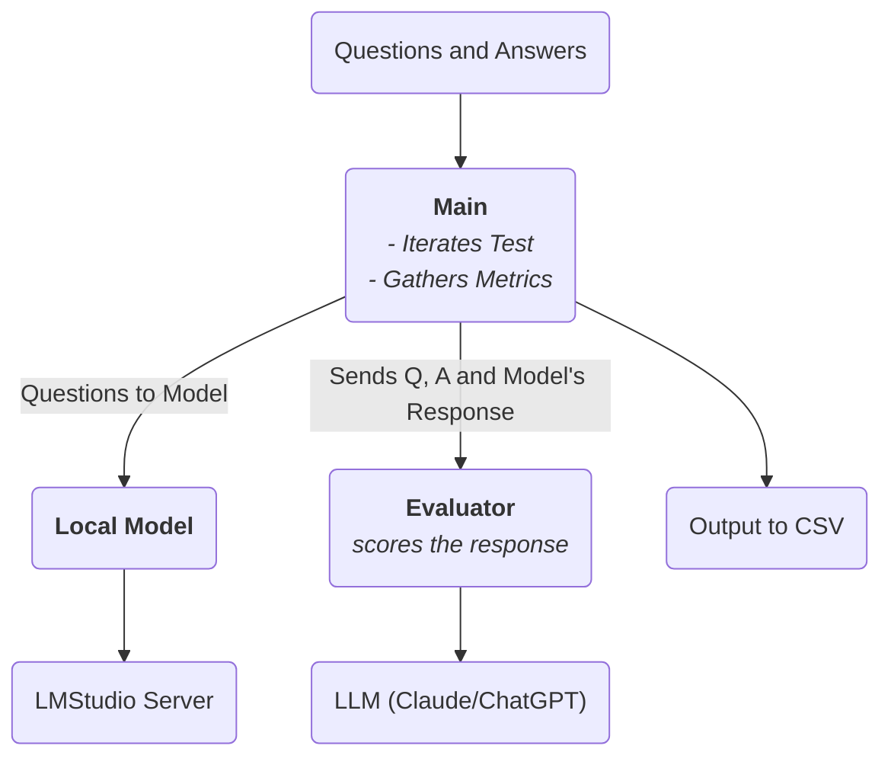

```mermaid
flowchart TD
    A(Questions and Answers) --> B
    B("`**Main**
      *- Iterates Test*
      *- Gathers Metrics*`") --> |Questions to Model| C
    B --> |Sends Q, A and Model's Response| D
    C("`**Local Model**`") --> 
    F(LMStudio Server)
    D("`**Evaluator**
      *scores the response*`") --> E
    E("LLM (Claude/ChatGPT)")
    B --> G(Output to CSV)
```