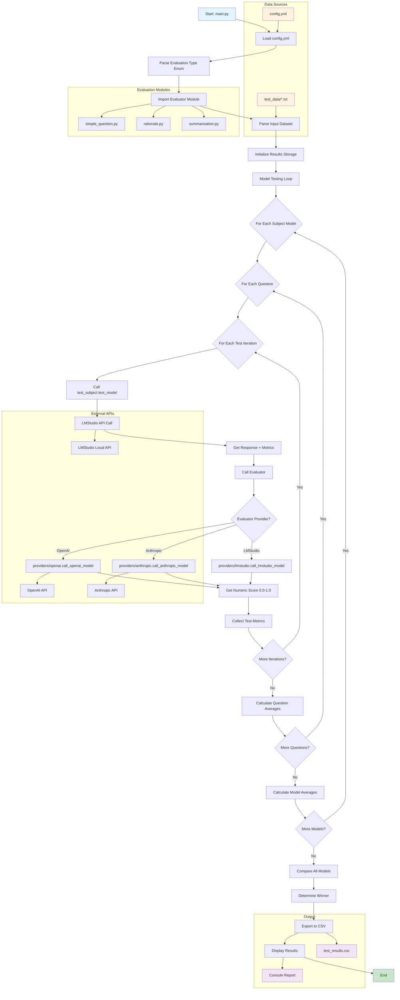
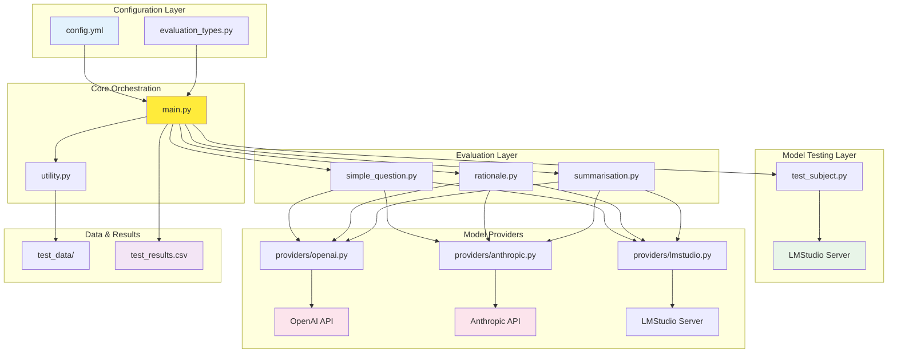

# Local LLM Testing Framework - System Architecture

## Overview

This system is a comprehensive **LLM evaluation and benchmarking framework** designed to test multiple local language models against various evaluation criteria and compare their performance. The architecture follows a modular design with clear separation of concerns between model testing, evaluation, and result aggregation.

## Core Components

### 1. Main Orchestrator (`main.py`)
**Purpose**: Central controller that orchestrates the entire testing pipeline
**Key Functions**:
- Configuration loading from `config.yml`
- Sequential testing of multiple subject models
- Coordination of evaluation processes
- Metrics collection and aggregation
- Result comparison and winner determination
- CSV export of detailed results

**Flow**: `main.py:16` → `load_config()` → `parse_input_data()` → `test_model()` → `evaluate()` → Results aggregation

### 2. Configuration Management (`config.yml`)
**Purpose**: Centralized configuration for test parameters
**Contains**:
- Subject models to test (provider, model name)
- Evaluator settings (provider, model)
- Test parameters (number of iterations, dataset)
- Evaluation type selection

### 3. Model Testing Layer
#### Subject Model Interface (`test_subject.py`)
**Purpose**: Interface to local LLM models via LMStudio
- Connects to local LMStudio server at `127.0.0.1:1234`
- Handles different evaluation types with specific instructions
- Measures response time and token usage
- Returns structured response data

**Key Function**: `test_subject.py:7` → `test_model()` - Primary interface for subject model testing

### 4. Evaluation Framework
#### Evaluation Types (`evaluators/evaluation_types.py`)
**Purpose**: Defines supported evaluation methodologies
- `SIMPLE_QUESTION`: Basic Q&A accuracy assessment
- `RATIONALE`: Complex reasoning evaluation
- `SUMMARISE`: Content summarization quality

#### Evaluation Engine (`evaluators/simple_question.py`)
**Purpose**: Implements scoring logic using external evaluator models
- Supports OpenAI and Anthropic evaluator models
- Standardized 0.0-1.0 scoring scale
- Focused on answer correctness comparison

**Flow**: `simple_question.py:4` → `evaluate()` → Model provider selection → API call → Numeric score

### 5. Model Provider Architecture (`providers/`)
The system now uses a modular provider architecture with separate modules for different model providers:

#### OpenAI Provider (`providers/openai.py`)
**Purpose**: Interface to OpenAI models for evaluation
- Uses OpenAI API with environment-based API key authentication
- Configurable temperature (default 0.2) and token limits (default 4000)
- Returns structured response with token usage metrics
- Function: `call_openai_model(model, system_prompt, prompt, temperature, max_output_tokens)`

#### Anthropic Provider (`providers/anthropic.py`)  
**Purpose**: Interface to Anthropic/Claude models for evaluation
- Uses Anthropic API with environment-based API key authentication
- Configurable temperature (default 0.2) and token limits (default 200)
- Returns structured response with token usage metrics
- Function: `call_anthropic_model(model, system_prompt, prompt, temperature, max_output_tokens)`

#### LMStudio Provider (`providers/lmstudio.py`)
**Purpose**: Interface to local LMStudio server for subject model testing
- Connects to local LMStudio server at `http://127.0.0.1:1234/v1`
- Uses OpenAI-compatible API interface with dummy API key
- Configurable temperature (default 0.5)
- Returns structured response with token usage metrics
- Function: `call_lmstudio_model(model, system_prompt, prompt, temperature)`

### 6. Data Processing (`utility.py`)
**Purpose**: Input data parsing and formatting
**Handles**:
- Q&A pair format (`Q: ... A: ...`)
- Question-only datasets
- Summarization text files
- Multiple file format detection

**Key Function**: `utility.py:1` → `parse_input_data()` - Processes test datasets

### 7. Test Data (`test_data/`)
**Purpose**: Contains various dataset formats
- `questions_simple.txt`: Basic Q&A pairs
- `questions_logical.txt`: Logic-based questions  
- `summarise_*.txt`: Text summarization tasks

### 8. Results Management (`test_results.csv`)
**Purpose**: Detailed test results export
**Contains**:
- Individual test results per question/model
- Per-question averages
- Per-model averages
- Performance metrics (tokens, response time, scores)

## System Flow Architecture

The system follows this high-level flow:

```
Config Loading → Dataset Parsing → Model Testing Loop → Evaluation → Results Aggregation → Winner Selection → CSV Export
```

### Detailed Flow:

1. **Initialization Phase** (`main.py:16-24`)
   - Load configuration from `config.yml`
   - Parse evaluation type enum
   - Import appropriate evaluator module

2. **Data Preparation** (`main.py:33`)
   - Parse input dataset using `utility.parse_input_data()`
   - Structure questions and expected answers

3. **Testing Loop** (`main.py:41-148`)
   - For each subject model:
     - For each question in dataset:
       - For each test iteration:
         - Call `test_subject.test_model()` 
         - Get response, timing, and token metrics
         - Call evaluator's `evaluate()` function
         - Collect metrics for aggregation
       - Calculate per-question averages
     - Calculate per-model averages

4. **Model Comparison** (`main.py:188-207`)
   - Compare all model performance metrics
   - Determine winning model by highest average score
   - Display comparative results

5. **Results Export** (`main.py:209-216`)
   - Export detailed results to CSV
   - Include individual tests, averages, and metadata

## Key Design Patterns

### 1. **Strategy Pattern**: Evaluation Types
- Different evaluation strategies (`SIMPLE_QUESTION`, `RATIONALE`, `SUMMARISE`)
- Dynamic module loading based on evaluation type
- Consistent interface across evaluation methods

### 2. **Factory Pattern**: Model Providers
- Modular provider architecture with separate provider modules
- Concrete implementations for OpenAI, Anthropic, and LMStudio
- Runtime provider selection based on configuration
- Unified response format across all providers

### 3. **Template Method**: Testing Pipeline
- Fixed testing sequence with configurable parameters
- Consistent metrics collection across all tests
- Standardized result aggregation

## Data Flow

### Input Data Flow:
```
config.yml → Configuration Loading → Test Parameters
test_data/*.txt → Data Parser → Structured Q&A Pairs
```

### Processing Data Flow:
```
Subject Model → LMStudio API → Response + Metrics
Response → Evaluator Model → Numeric Score (0.0-1.0)
Metrics → Aggregation → Per-Question/Model Averages
```

### Output Data Flow:
```
Individual Results → CSV Export → test_results.csv
Aggregated Metrics → Console Output → Model Comparison
Winner Selection → Final Report → Performance Summary
```

## Extensibility Points

1. **New Evaluation Types**: Add modules in `evaluators/` directory
2. **New Model Providers**: Implement provider interface in `providers/` directory with consistent function signature
3. **New Data Formats**: Extend `utility.parse_input_data()` parsing logic
4. **New Metrics**: Modify result collection in main testing loop
5. **New Output Formats**: Add export functions alongside CSV generation

## Dependencies

- **OpenAI Python SDK**: For evaluator model API calls and LMStudio compatibility
- **Anthropic SDK**: For Claude evaluator models  
- **PyYAML**: Configuration file parsing
- **python-dotenv**: Environment variable management for API keys
- **Standard Library**: CSV, statistics, importlib for core functionality

This architecture provides a flexible, scalable framework for comprehensive LLM evaluation with clear separation of concerns and extensive configurability.

## System Flow Diagram



## Component Interaction Diagram

