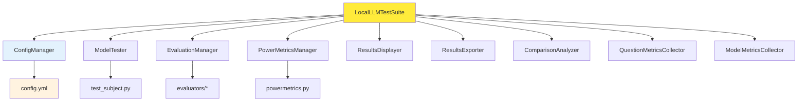

# Local LLM Testing Framework - System Architecture

## Overview

This system is a comprehensive **LLM evaluation and benchmarking framework** designed to test multiple local language models against various evaluation criteria and compare their performance. The architecture follows a **modular, object-oriented design** with clear separation of concerns across specialized components, making it highly maintainable, testable, and extensible.

## Refactored Architecture Components

### 1. Main Orchestrator (`main.py`)
**Class**: `LocalLLMTestSuite`
**Purpose**: Central orchestrator that coordinates all testing components
**Key Responsibilities**:
- Initializes and manages all specialized components
- Coordinates the complete test execution pipeline
- Delegates specific tasks to appropriate managers
- Provides clean, simple entry point (`python main.py`)

**Architecture Pattern**: **Facade Pattern** - Provides simplified interface to complex subsystem

### 2. Configuration Management (`config_manager.py`)
**Class**: `ConfigManager`
**Purpose**: Centralized configuration loading and validation
**Key Features**:
- YAML configuration file parsing
- Enum conversion for evaluation types
- Property-based access to configuration values
- Lazy loading of configuration data

**Key Methods**:
- `load_config()` - Loads and validates configuration
- Property accessors for all config values

### 3. Model Testing Layer (`model_tester.py`)
**Class**: `ModelTester`
**Purpose**: Handles all model testing operations
**Key Responsibilities**:
- Single iteration model testing
- Multiple test execution with aggregation
- Response detail display
- Model response validation

**Key Methods**:
- `test_single_iteration()` - Tests model once
- `run_multiple_tests()` - Runs multiple test iterations
- `test_question_batch()` - Handles complete question testing

### 4. Evaluation Management (`evaluation_manager.py`)
**Class**: `EvaluationManager`
**Purpose**: Dynamic evaluator loading and response evaluation
**Key Features**:
- Dynamic module importing based on evaluation type
- Unified evaluation interface
- Support for both legacy and new evaluation formats
- Evaluation result display

**Key Methods**:
- `evaluate_response()` - Evaluates model responses
- `display_evaluation_results()` - Shows evaluation details

### 5. Metrics Collection (`metrics_collector.py`)
**Classes**: `MetricsCollector`, `QuestionMetricsCollector`, `ModelMetricsCollector`
**Purpose**: Comprehensive metrics aggregation and CSV row generation
**Key Features**:
- Hierarchical metrics collection (individual → question → model)
- Statistical aggregation (averages, etc.)
- CSV row generation for different aggregation levels
- Type-safe metric handling

**Key Methods**:
- `add_metric()` - Adds individual test metrics
- `get_averages()` - Calculates statistical averages
- `create_csv_row()` - Generates CSV data rows

### 6. Results Display (`results_displayer.py`)
**Class**: `ResultsDisplayer`
**Purpose**: Console output formatting and presentation
**Key Features**:
- Consistent output formatting
- Hierarchical result display (test → question → model → comparison)
- Structured console output with separators
- Winner announcement formatting

**Key Methods**:
- `display_model_header()` - Model testing headers
- `display_question_averages()` - Question-level summaries
- `display_model_comparison()` - Final comparison display

### 7. Results Export (`results_exporter.py`)
**Class**: `ResultsExporter`
**Purpose**: CSV file generation and export
**Key Features**:
- Structured CSV export with defined fieldnames
- UTF-8 encoding support
- Configurable output filename
- Success confirmation messaging

**Key Methods**:
- `export_to_csv()` - Exports complete CSV file

### 8. Power Metrics Management (`power_metrics_manager.py`)
**Class**: `PowerMetricsManager`
**Purpose**: Energy monitoring and power usage tracking
**Key Features**:
- Optional power monitoring (configurable)
- Energy consumption calculations
- Power usage display formatting
- Integration with PowerMetricsCollector

**Key Methods**:
- `start_monitoring()` - Begins power collection
- `stop_monitoring()` - Ends collection and returns usage
- `calculate_energy_consumption()` - Converts power to energy

### 9. Comparison Analysis (`comparison_analyzer.py`)
**Class**: `ComparisonAnalyzer`
**Purpose**: Model performance comparison and ranking
**Key Features**:
- Winner determination by multiple criteria
- Model ranking algorithms (score, efficiency, energy efficiency)
- Statistical analysis of model performance
- Extensible comparison metrics

**Key Methods**:
- `find_winning_model()` - Determines best performing model
- `rank_models_by_score()` - Ranks by evaluation scores
- `rank_models_by_efficiency()` - Ranks by score/time ratio

## Architecture Benefits

### 🎯 **Single Responsibility Principle**
Each class has one clear, focused responsibility:
- ConfigManager → Configuration only
- ModelTester → Model testing only  
- MetricsCollector → Metrics aggregation only
- etc.

### 🔧 **High Maintainability**
- Individual components can be modified without affecting others
- Clear interfaces between components
- Easy to debug and test individual parts

### 🧪 **High Testability**
- Each component can be unit tested independently
- Clear dependencies that can be mocked
- Isolated functionality for focused testing

### 📖 **Improved Readability**
- Self-documenting class and method names
- Clear separation of concerns
- Reduced cognitive load per component

### ♻️ **High Reusability**
- Components can be used in other contexts
- Clear interfaces allow easy integration
- Modular design enables component reuse

### 🏗️ **High Extensibility**
- Easy to add new evaluation types
- Simple to add new metrics collectors
- Straightforward to add new output formats

## System Flow Architecture

The refactored system follows this clean flow:

```
LocalLLMTestSuite.run_complete_test_suite() → 
  For each model:
    _test_model() → 
      For each question:
        _test_question() → 
          For each iteration:
            _run_single_test() → ModelTester + EvaluationManager + PowerMetricsManager
```

### Detailed Component Flow:

1. **Initialization Phase**
   - `LocalLLMTestSuite.__init__()` creates all component instances
   - `ConfigManager` loads and validates configuration
   - All managers initialized with appropriate dependencies

2. **Test Execution Phase**
   - `run_complete_test_suite()` orchestrates the complete pipeline
   - `_test_model()` handles per-model testing and metrics
   - `_test_question()` manages question-level iterations
   - `_run_single_test()` executes individual test cycles

3. **Results Phase**
   - `ComparisonAnalyzer` determines winners and rankings
   - `ResultsDisplayer` formats and shows console output
   - `ResultsExporter` generates CSV files

## Key Design Patterns Used

### 1. **Facade Pattern**: LocalLLMTestSuite
- Provides simple interface to complex subsystem
- Hides internal component complexity
- Single point of entry for all operations

### 2. **Strategy Pattern**: Evaluation Types
- Different evaluation strategies handled by EvaluationManager
- Dynamic strategy selection based on configuration
- Consistent interface across evaluation methods

### 3. **Factory Pattern**: Model Providers  
- Modular provider architecture maintained
- Runtime provider selection preserved
- Unified response format across providers

### 4. **Composition Pattern**: Component Assembly
- LocalLLMTestSuite composed of specialized managers
- Clear dependency relationships
- Flexible component swapping possible

### 5. **Template Method Pattern**: Testing Pipeline
- Fixed testing sequence with configurable behavior
- Consistent metrics collection workflow
- Standardized result aggregation process

## Component Dependencies



## Data Flow Architecture

### Input Data Flow:
```
config.yml → ConfigManager → Properties
test_data/*.txt → parse_input_data() → Structured Q&A Pairs
```

### Processing Data Flow:
```
ModelTester → test_subject.py → LMStudio API → Response
EvaluationManager → evaluators/* → Provider APIs → Scores
PowerMetricsManager → powermetrics.py → Energy Data
MetricsCollector → Statistical Aggregation → Averages
```

### Output Data Flow:
```
MetricsCollector → CSV Data → ResultsExporter → test_results.csv
ComparisonAnalyzer → Winner Analysis → ResultsDisplayer → Console Output
```

## Extensibility Points

The refactored architecture provides clear extension points:

1. **New Evaluation Types**: 
   - Add evaluator modules in `evaluators/` directory
   - EvaluationManager automatically handles dynamic loading

2. **New Model Providers**: 
   - Implement provider interface in `providers/` directory
   - Existing provider selection logic remains unchanged

3. **New Metrics**: 
   - Extend MetricsCollector classes with new metric types
   - Add corresponding display methods to ResultsDisplayer

4. **New Output Formats**: 
   - Create new exporter classes following ResultsExporter pattern
   - Add to LocalLLMTestSuite initialization

5. **New Comparison Algorithms**: 
   - Add methods to ComparisonAnalyzer class
   - Extend result display for new ranking types

## File Structure

```
local-llm/
├── main.py                     # LocalLLMTestSuite orchestrator
├── config_manager.py           # Configuration management
├── model_tester.py             # Model testing operations
├── evaluation_manager.py       # Evaluation coordination
├── power_metrics_manager.py    # Energy monitoring
├── metrics_collector.py        # Metrics aggregation
├── results_displayer.py        # Console output formatting
├── results_exporter.py         # CSV export functionality
├── comparison_analyzer.py      # Model comparison and ranking
├── test_subject.py             # Subject model interface
├── utility.py                  # Data parsing utilities
├── powermetrics.py            # Power collection implementation
├── config.yml                 # Configuration file
├── evaluators/                # Evaluation modules
├── providers/                 # Model provider interfaces
└── test_data/                 # Test datasets
```

## Dependencies

- **OpenAI Python SDK**: For evaluator model API calls and LMStudio compatibility
- **Anthropic SDK**: For Claude evaluator models  
- **PyYAML**: Configuration file parsing
- **python-dotenv**: Environment variable management for API keys
- **Standard Library**: CSV, statistics, importlib, typing for core functionality

This refactored architecture transforms a monolithic 275-line main function into a clean, maintainable, object-oriented system with clear separation of concerns and excellent extensibility.